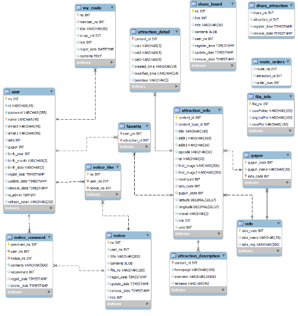

# EnjoyTrip (ver1.0)

---

## 소개

---

공공 데이터 포털의 오픈 API를 이용하여 관광지와 여행에 대한 정보를 제공하고 사용자를 위한 편의 기능을 제공하는 웹 서비스

## 구성원

---

정형준 ( Brojjun )

정민

## 기능

---

- 여행지 정보 제공
- 로그인 관련 기능
- 공지사항 기능
    - 댓글
    - 답글
    - 파일 업로드 && 다운로드
    - 추천
    

## 개발환경

---

- 형상관리 : Github, SourceTree
- Backend : Spring, SpringBoot, JAVA, MyBatis
- FrontEnd : Vue.js, HTML, CSS
- DB : MySQL

# 프로젝트 진행

---

## 프로젝트 패키지 구조

---

- Backend
    
    ```
    │  .gitignore
    │  mvnw
    │  mvnw.cmd
    │  pom.xml
    │
    ├─.mvn
    │  └─wrapper
    │          maven-wrapper.jar
    │          maven-wrapper.properties
    │
    ├─db
    │      enjoytrip_attraction_description.sql
    │      enjoytrip_attraction_detail.sql
    │      enjoytrip_attraction_info.sql
    │      enjoytrip_favorite.sql
    │      enjoytrip_gugun.sql
    │      enjoytrip_like_notice.sql
    │      enjoytrip_my_route.sql
    │      enjoytrip_notice.sql
    │      enjoytrip_route_orders.sql
    │      enjoytrip_share_attraction.sql
    │      enjoytrip_share_board.sql
    │      enjoytrip_sido.sql
    │      enjoytrip_ucomment.sql
    │      enjoytrip_ufile.sql
    │      enjoytrip_user.sql
    │      enjoytrip_zlastInsert.sql
    │
    ├─Servers
    │  └─VMware tc Server Developer Edition v4.1-config
    │          catalina.policy
    │          catalina.properties
    │          context.xml
    │          jmxremote.access
    │          jmxremote.password
    │          server.xml
    │          tomcat-users.xml
    │          web.xml
    │
    └─src
        ├─main
        │  ├─java
        │  │  └─com
        │  │      └─enjoy
        │  │          └─trip
        │  │              │  EnjoyTripApplication.java
        │  │              │
        │  │              ├─config
        │  │              │      JwtManager.java
        │  │              │      MailManager.java
        │  │              │      SHA256Manager.java
        │  │              │
        │  │              ├─controller
        │  │              │      HomeController.java
        │  │              │      MyPageController.java
        │  │              │      NoticeController.java
        │  │              │      UserController.java
        │  │              │
        │  │              ├─dto
        │  │              │      AttractionDescription.java
        │  │              │      AttractionDetail.java
        │  │              │      AttractionInfo.java
        │  │              │      FileInfo.java
        │  │              │      Gugun.java
        │  │              │      MailDto.java
        │  │              │      MyRoute.java
        │  │              │      Notice.java
        │  │              │      NoticeComment.java
        │  │              │      NoticeLike.java
        │  │              │      Page.java
        │  │              │      PageResult.java
        │  │              │      RouteOrders.java
        │  │              │      ShareAttraction.java
        │  │              │      ShareBoard.java
        │  │              │      Sido.java
        │  │              │      User.java
        │  │              │
        │  │              ├─interceptor
        │  │              │      AuthorizationExtractor.java
        │  │              │      TokenAuthInterceptor.java
        │  │              │      WebMvcConfig.java
        │  │              │
        │  │              ├─mapper
        │  │              │      AttractionMapper.java
        │  │              │      BoardMapper.java
        │  │              │      FileMapper.java
        │  │              │      LocationMapper.java
        │  │              │      MypageMapper.java
        │  │              │      NoticeCommentMapper.java
        │  │              │      NoticeMapper.java
        │  │              │      RouteMapper.java
        │  │              │      ShareAttractionMapper.java
        │  │              │      UserMapper.java
        │  │              │
        │  │              ├─paging
        │  │              │      Page.java
        │  │              │      PageResult.java
        │  │              │
        │  │              ├─rest
        │  │              │  └─controller
        │  │              │          AttracationRestController.java
        │  │              │          BoardRestController.java
        │  │              │          DownLoadRestController.java
        │  │              │          LocationRestController.java
        │  │              │          MyPageRestController.java
        │  │              │          NoticeCommentRestController.java
        │  │              │          NoticeRestController.java
        │  │              │          RouteRestController.java
        │  │              │          ShareAttractionRestController.java
        │  │              │          UserRestController.java
        │  │              │
        │  │              └─service
        │  │                      AttractionService.java
        │  │                      AttractionServiceImpl.java
        │  │                      BoardService.java
        │  │                      BoardServiceImpl.java
        │  │                      FileService.java
        │  │                      FileServiceImpl.java
        │  │                      LocationService.java
        │  │                      LocationServiceImpl.java
        │  │                      MyPageService.java
        │  │                      MyPageServiceImpl.java
        │  │                      NoticeCommentService.java
        │  │                      NoticeCommentServiceImpl.java
        │  │                      NoticeService.java
        │  │                      NoticeServiceImpl.java
        │  │                      RouteService.java
        │  │                      RouteServiceImpl.java
        │  │                      ShareAttractionService.java
        │  │                      ShareAttractionServiceImpl.java
        │  │                      UserService.java
        │  │                      UserServiceImpl.java
        │  │
        │  ├─resources
        │  │  │  .gitignore
        │  │  │  mybatis-config.xml
        │  │  │
        │  │  ├─mapper
        │  │  │      AttractionMapper.xml
        │  │  │      BoardMapper.xml
        │  │  │      FileMapper.xml
        │  │  │      LocationMapper.xml
        │  │  │      MypageMapper.xml
        │  │  │      NoticeCommentMapper.xml
        │  │  │      NoticeMapper.xml
        │  │  │      RouteMapper.xml
        │  │  │      ShareAttraction.xml
        │  │  │      UserMapper.xml
        │  │  │
        │  │  └─static
        │  │      └─resource
        │  │          ├─common
        │  │          │  ├─css
        │  │          │  │      common.css
        │  │          │  │      responsiveJM.min.css
        │  │          │  │
        │  │          │  ├─img
        │  │          │  │      18x18_x_icon_purple.png
        │  │          │  │      18x18_x_icon_white.png
        │  │          │  │      22x18_notice_icon.png
        │  │          │  │      pagination_style_0_double_left_arrow.png
        │  │          │  │      pagination_style_0_double_right_arrow.png
        │  │          │  │      pagination_style_0_single_left_arrow.png
        │  │          │  │      pagination_style_0_single_right_arrow.png
        │  │          │  │      swiper_arrow_left.png
        │  │          │  │      swiper_arrow_left_h.png
        │  │          │  │      swiper_arrow_right.png
        │  │          │  │      swiper_arrow_right_h.png
        │  │          │  │
        │  │          │  └─js
        │  │          │          common.js
        │  │          │          gnb.js
        │  │          │          import.js
        │  │          │          PopupManager.js
        │  │          │          vanillaAjax.js
        │  │          │          windowLoad.js
        │  │          │
        │  │          └─theme
        │  │              ├─css
        │  │              │      theme.common.css
        │  │              │      theme.layout.main.css
        │  │              │      theme.layout.sub.css
        │  │              │      theme.page.main.css
        │  │              │      theme.page.mypage.css
        │  │              │      theme.page.sub.css
        │  │              │      theme.resource.footer.css
        │  │              │      theme.resource.header.css
        │  │              │
        │  │              ├─img
        │  │              │      1.jpg
        │  │              │      10.jpg
        │  │              │      11.jpg
        │  │              │      13.jpg
        │  │              │      14.jpg
        │  │              │      15.jpg
        │  │              │      2.jpeg
        │  │              │      20.JPG
        │  │              │      21-2.jpg
        │  │              │      3.jpg
        │  │              │      5.jpg
        │  │              │      7.jpg
        │  │              │      8.jpg
        │  │              │      9.jpg
        │  │              │      android-chrome-512x512.png
        │  │              │      apple-touch-icon.png
        │  │              │      favicon-16x16.png
        │  │              │      favicon-32x32.png
        │  │              │      favicon.ico
        │  │              │      logo-white.png
        │  │              │      logo.png
        │  │              │
        │  │              └─js
        │  │                      findPw.js
        │  │                      login.js
        │  │                      logout.js
        │  │                      main.js
        │  │                      mypage.js
        │  │                      signUp.js
        │  │
        │  └─webapp
        │      └─WEB-INF
        │          └─views
        │              │  home.jsp
        │              │
        │              ├─import
        │              │      importMain.jsp
        │              │      importMypage.jsp
        │              │      importSub.jsp
        │              │
        │              └─page
        │                  ├─attraction
        │                  │      attractionList.jsp
        │                  │      attractionView.jsp
        │                  │      localList.jsp
        │                  │      search.jsp
        │                  │
        │                  ├─error
        │                  │      error.jsp
        │                  │
        │                  ├─inc
        │                  │      footer.jsp
        │                  │      header.jsp
        │                  │
        │                  ├─main
        │                  │      main.jsp
        │                  │
        │                  ├─mypage
        │                  │      mypage.jsp
        │                  │
        │                  └─notice
        │                          list.jsp
        │                          view.jsp
        │
        └─test
            └─java
                └─com
                    └─enjoy
                        └─trip
                                EnjoyTripApplicationTests.java
    ```
    

- Frontend

```
│  .browserslistrc
│  .eslintrc.js
│  .gitignore
│  babel.config.js
│  jsconfig.json
│  package-lock.json
│  package.json
│  README.md
│  vue.config.js
│
├─public
│      favicon.ico
│      index.html
│
└─src
    │  App.vue
    │  main.js
    │
    ├─api
    │      attraction.js
    │      file.js
    │      http.js
    │      location.js
    │      notice.js
    │      route.js
    │      user.js
    │
    ├─assets
    │  │  logo.png
    │  │  Setting.js
    │  │
    │  └─resource
    │      ├─common
    │      │  ├─css
    │      │  │      common.css
    │      │  │      import.css
    │      │  │      responsiveJM.min.css
    │      │  │
    │      │  ├─img
    │      │  │      18x18_x_icon_purple.png
    │      │  │      18x18_x_icon_white.png
    │      │  │      19x19_white_search_icon.png
    │      │  │      20x15_download_icon_0d4da1.png
    │      │  │      22x18_notice_icon.png
    │      │  │      48x48_write_white_icon.png
    │      │  │      64x64_bookmark_black_empty_icon.png
    │      │  │      64x64_bookmark_black_full_icon.png
    │      │  │      64x64_bookmark_grey_empty_icon.png
    │      │  │      6x11_blue_arrow.png
    │      │  │      7x13_grey_arrow.png
    │      │  │      7x13_purple_arrow.png
    │      │  │      9x5_down_arrow_fullblack.png
    │      │  │      pagination_style_0_double_left_arrow.png
    │      │  │      pagination_style_0_double_right_arrow.png
    │      │  │      pagination_style_0_single_left_arrow.png
    │      │  │      pagination_style_0_single_right_arrow.png
    │      │  │      swiper_arrow_left.png
    │      │  │      swiper_arrow_left_h.png
    │      │  │      swiper_arrow_right.png
    │      │  │      swiper_arrow_right_h.png
    │      │  │
    │      │  └─js
    │      │          Common.js
    │      │          gnb.js
    │      │          PopupManager.js
    │      │
    │      └─theme
    │          │  favicon.ico
    │          │
    │          ├─css
    │          │      theme.common.css
    │          │      theme.layout.main.css
    │          │      theme.layout.sub.css
    │          │      theme.page.main.css
    │          │      theme.page.mypage.css
    │          │      theme.page.sub.css
    │          │      theme.page.subView.css
    │          │      theme.resource.footer.css
    │          │      theme.resource.header.css
    │          │      theme.resource.login.css
    │          │
    │          ├─img
    │          │      1.jpg
    │          │      10.jpg
    │          │      11.jpg
    │          │      13.jpg
    │          │      14.jpg
    │          │      15.jpg
    │          │      2.jpeg
    │          │      20.jpg
    │          │      21-2.jpg
    │          │      3.jpg
    │          │      5.jpg
    │          │      7.jpg
    │          │      8.jpg
    │          │      9.jpg
    │          │      android-chrome-512x512.png
    │          │      apple-touch-icon.png
    │          │      favicon-16x16.png
    │          │      favicon-32x32.png
    │          │      logo-white.png
    │          │      logo.png
    │          │
    │          └─js
    │                  findPw.js
    │                  login.js
    │                  logout.js
    │                  main.js
    │                  mypage.js
    │                  signUp.js
    │
    ├─components
    │  ├─attraction
    │  │  ├─list
    │  │  │      AttractionList.vue
    │  │  │      AttractionListItem.vue
    │  │  │      AttractionSearchBar.vue
    │  │  │
    │  │  └─view
    │  │          AttractionView.vue
    │  │
    │  ├─inc
    │  │  ├─footer
    │  │  │      TheFooter.vue
    │  │  │
    │  │  └─header
    │  │      │  TheHeader.vue
    │  │      │
    │  │      └─item
    │  │              FindPwPopup.vue
    │  │              Gnb.vue
    │  │              LoginPopup.vue
    │  │              SignUpPopup.vue
    │  │              Util.vue
    │  │
    │  ├─main
    │  │      MainVisual.vue
    │  │
    │  ├─notice
    │  │  │  NoticeModify.vue
    │  │  │  NoticeView.vue
    │  │  │  NoticeWrite.vue
    │  │  │
    │  │  ├─comment
    │  │  │      NoticeComment.vue
    │  │  │      NoticeCommentListItem.vue
    │  │  │
    │  │  └─list
    │  │          NoticeList.vue
    │  │          NoticeListItem.vue
    │  │
    │  ├─route
    │  │  ├─list
    │  │  │      RouteList.vue
    │  │  │      RouteListItem.vue
    │  │  │      RouteSearchBar.vue
    │  │  │
    │  │  ├─update
    │  │  │      RouteUpdate.vue
    │  │  │
    │  │  ├─view
    │  │  │      RouteView.vue
    │  │  │
    │  │  └─write
    │  │          RouteWrite.vue
    │  │
    │  ├─user
    │  │  │  UserFindId.vue
    │  │  │  UserFindPw.vue
    │  │  │  UserLogin.vue
    │  │  │  UserLogout.vue
    │  │  │  UserSignUp.vue
    │  │  │
    │  │  └─mypage
    │  │      │  UserMyPage.vue
    │  │      │
    │  │      └─contents
    │  │              UserFavorite.vue
    │  │              UserInfoUpdate.vue
    │  │              UserMyPlanner.vue
    │  │
    │  └─util
    │          AlertPopup.vue
    │          KakaoMap.vue
    │
    ├─router
    │      index.js
    │
    ├─store
    │  │  index.js
    │  │
    │  └─modules
    │      ├─common
    │      │      popupStore.js
    │      │
    │      └─theme
    │              favoriteStore.js
    │              locationStore.js
    │              userStore.js
    │
    └─views
            AppAttraction.vue
            AppMain.vue
            AppNotice.vue
            AppRoute.vue
            AppUser.vue
            BoardView.vue
            HomeView.vue
```

## ER 다이어그램

---



## 클래스 다이어그램

---


# 화면설계

---

- 메인페이지


- 로그인 페이지


- 회원가입 페이지


- 아이디 찾기 페이지


- 비밀번호 찾기 페이지


- 회원정보 수정 페이지


- 플래너 페이지


- 플래너 작성 페이지


- 여행지 검색 페이지


- 여행지 자세히 보기 페이지


- 공지사항 페이지


- 글 자세히 보기


- 공지사항 작성 페이지


- 공지사항 수정 페이지

